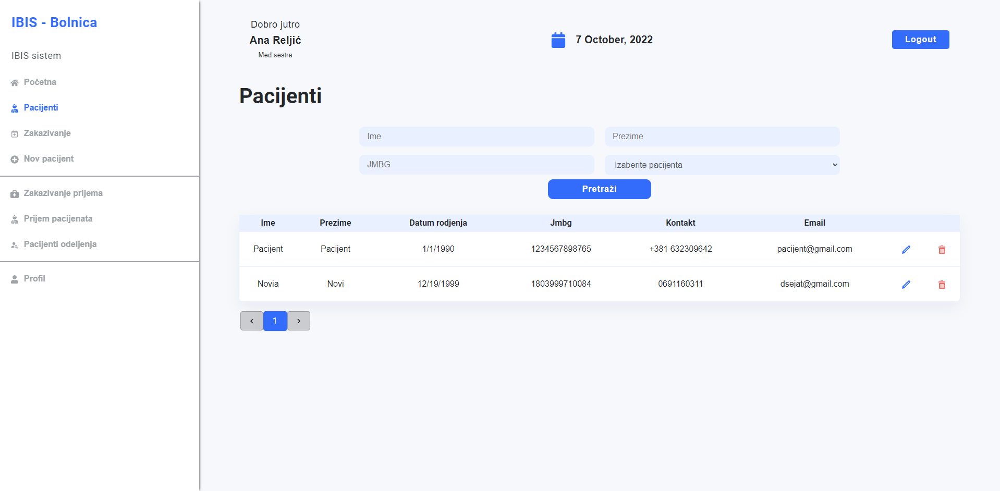
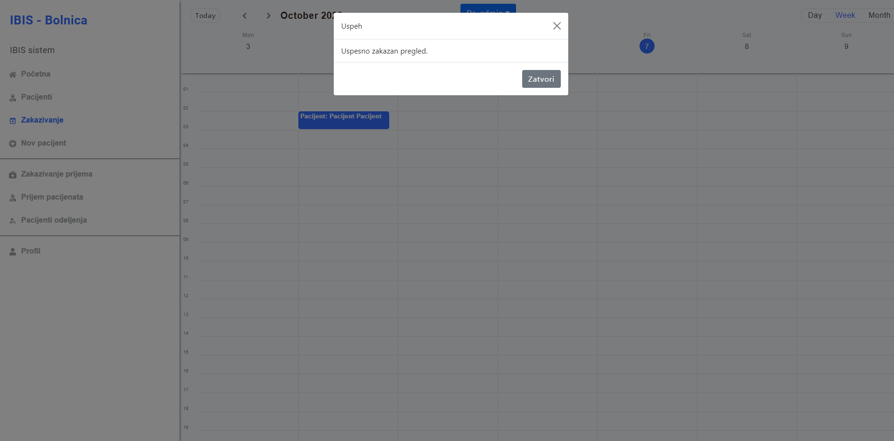
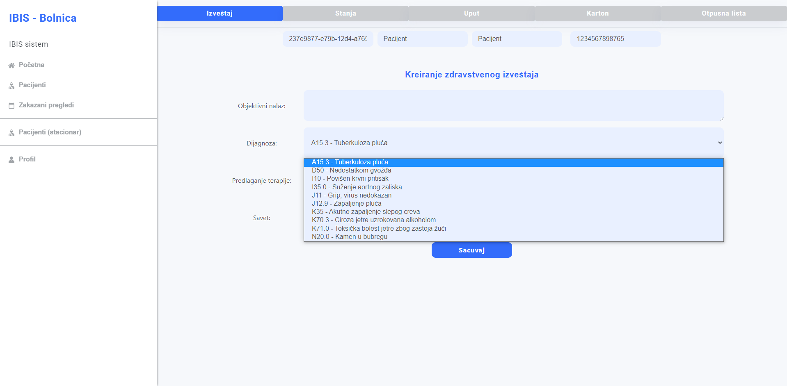
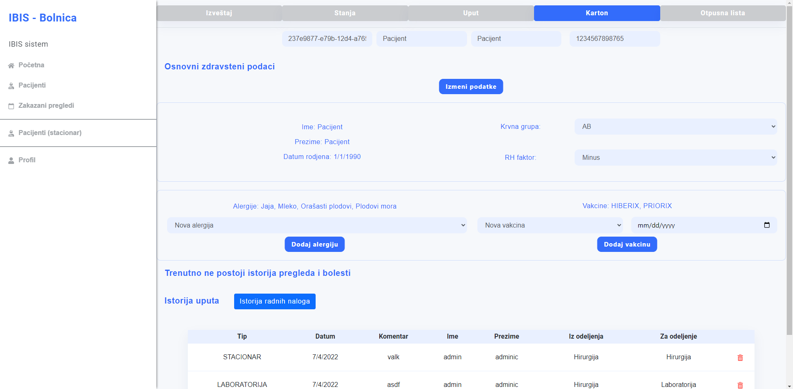

# RAF Software Engineering - Hospital - FRONTEND

A large project made in React at the teamlead position for frontend, for an university course "Software Engineering". The project was done in 4 months, with a team of 5 people. It was done in React, accoring to the project specification, and deployed with [Docker}(https://www.docker.com/) and [Kubernetes](https://kubernetes.io/) on [http://bolnica.k8s.elab.rs:32264/](http://bolnica.k8s.elab.rs:32264/). The test user credentials are test@gmail.com-password.

There are 7 roles: admin, doctor, nurse, biochemist, technician and recepcionist

## Patient preview

## Examination schedule

## Doctor examination

## Patient medical record

## Available Scripts

In the project directory, you can run:

### `npm start`

Runs the app in the development mode.\
Open [http://localhost:3000](http://localhost:3000) to view it in your browser.

The page will reload when you make changes.\
You may also see any lint errors in the console.

### `npm test`

Launches the test runner in the interactive watch mode.\
See the section about [running tests](https://facebook.github.io/create-react-app/docs/running-tests) for more information.

### `npm run build`

Builds the app for production to the `build` folder.\
It correctly bundles React in production mode and optimizes the build for the best performance.

The build is minified and the filenames include the hashes.\
Your app is ready to be deployed!
